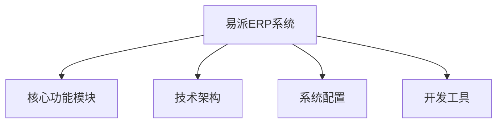
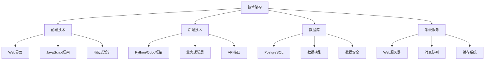
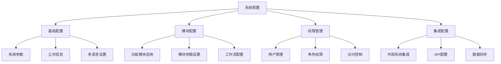
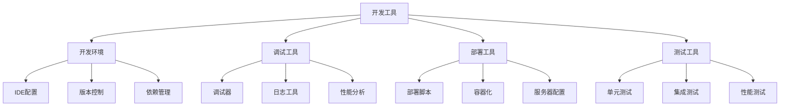

# 易派ERP系统架构思维导图

## 1. 系统概览

## 2. 核心功能模块

```mermaid
graph TB
    B[核心功能模块] --> B1[CRM客户关系管理]
    B --> B2[销售管理]
    B --> B3[采购管理]
    B --> B4[库存管理]
    B --> B5[制造管理]
    B --> B6[财务会计]
    B --> B7[人力资源]
    B --> B8[项目管理]
    
    B1 --> B1A[客户管理]
    B1 --> B1B[商机管理]
    B1 --> B1C[营销活动]
    
    B2 --> B2A[销售订单]
    B2 --> B2B[报价管理]
    B2 --> B2C[电子商务]
    
    B3 --> B3A[供应商管理]
    B3 --> B3B[采购订单]
    B3 --> B3C[采购分析]
    
    B4 --> B4A[库存跟踪]
    B4 --> B4B[仓库管理]
    B4 --> B4C[库存分析]
    
    B5 --> B5A[生产计划]
    B5 --> B5B[工单管理]
    B5 --> B5C[质量控制]
    
    B6 --> B6A[总账]
    B6 --> B6B[应收应付]
    B6 --> B6C[资产管理]
    
    B7 --> B7A[员工管理]
    B7 --> B7B[考勤管理]
    B7 --> B7C[薪资管理]
    
    B8 --> B8A[项目规划]
    B8 --> B8B[任务管理]
    B8 --> B8C[时间跟踪]
```

## 3. 技术架构

## 4. 系统配置

## 5. 开发工具

## 说明

本思维导图展示了易派ERP系统的整体架构，包括以下主要部分：

1. **核心功能模块**：展示了系统的主要业务功能，包括CRM、销售、采购、库存等模块，以及各模块的具体功能点。

2. **技术架构**：描述了系统的技术实现架构，包括前端技术、后端技术、数据库和系统服务等层面。

3. **系统配置**：展示了系统的各类配置项，包括基础配置、模块配置、权限管理和集成配置等。

4. **开发工具**：列出了系统开发和维护所需的各类工具，包括开发环境、调试工具、部署工具和测试工具等。

通过这个思维导图，您可以清晰地了解到：

- 系统的整体架构和各个组成部分
- 各个模块之间的关系和层次结构
- 系统的技术实现方案
- 配置和开发相关的工具和流程

这个架构图可以帮助您更好地理解系统的整体结构，便于进行系统开发、维护和管理。